# Mini Realistic Airways

A mini-realistic mod for Mini Airways.

Use `Tab` to close text display on altitude, speed, type and fuel level below the aircraft.

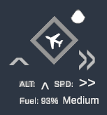 

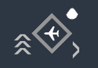

To disable wind, use `Wind` toggle in `Options` menu or add `-disableWind` to launch options. To disable events, use `Event` toggle in `Options` menu or add `-disableEvents` to launch options.

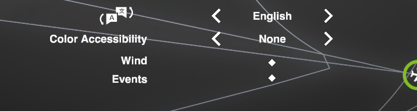

# How to Install

- Switch the game to `mod_feat` [branch](https://partner.steamgames.com/doc/store/application/branches?) on Steam.
- Copy [MiniRealisticAirways.dll](https://github.com/ericpzh/MiniRealisticAirways/blob/main/bin/Debug/netstandard2.1/MiniRealisticAirways.dll) into `<path_to_game>\Mini Airways Playtest\BepInEx\plugins`

# Altitude

Aircraft in the air may be in one of the three altitudes, low , normal , and high . The current altitude of an aircraft is displayed on the left of aircraft icon and is displayed below the aircraft as: `ALT: ^` of an aircraft.
Aircraft and upgrades interact with altitude in the following ways:
- Arrival aircraft from outside of the screen arrives at high  altitude.
- Arrival aircraft can only land when it is at low  altitude.
- Departure aircraft will start at low  altitude after take-off sequence finishes.
- Departure aircraft will only be able to reach departure (colored) waypoint at normal  or high  altitude.
- Landing waypoint will instruct aircraft to reach low  altitude and issue the landing clearance.
- Terrain (Red) will not affect aircraft in high  altitude. Restricted area (yellow), however, will.

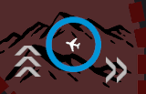

- When two aircraft are about to crash, TCAS will command one to climb and the other to descend when possible.
- When aircraft is about to crash into terrain (Red), GPWS will command aircraft to climb.
- Landing aircraft are not commanded by TCAS or GPWS.

You can control the altitude of the aircraft by:
- Press `W` while hovering mouse over or commanding an aircraft will increase its altitude, when animation is completed.
- Press `S` while hovering mouse over or commanding an aircraft will decrease its altitude, when animation is completed.
- `Scroll Up` while hovering mouse over an aircraft will increase its altitude, when animation is completed.
- `Scroll Down` while hovering mouse over an aircraft will decrease its altitude, when animation is completed.

Waypoint/take-off waypoint can command aircraft's altitude. You can control the altitude of the waypoint/take-off waypoint by:
- Press `W` or `Scroll Up` and holding a waypoint will increase its altitude.
- Press `S` or `Scroll Down` and holding a waypoint will decrease its altitude.

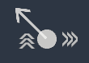

# Speed

Aircraft in the air may be in one of the three speeds, slow , normal , and fast . The current speed of an aircraft is displayed on the right of aircraft icon and is displayed below the aircraft as: `SPD: >` and arrow on left/right of an aircraft.
Aircraft and upgrades interact with altitude in the following ways:
- Arrival aircraft from outside of the screen arrives at normal  speed.
- Arrival aircraft can land when it is in slow  or normal  speed.
- Arrival aircraft going around will lift off at normal  speed.
- Departure aircraft will start at normal  speed after take-off sequence finishes.
- Landing waypoint will instruct aircraft to first reach normal  speed if the current speed is fast  and then issue the landing clearance.

You can control the altitude of the aircraft by:
- Press `D` while hovering mouse over or commanding an aircraft will increase its speed, when animation is completed.
- Press `A` while hovering mouse over or commanding an aircraft will decrease its speed, when animation is completed.
- Hold `left shift` while `Scroll Up` and hovering mouse over an aircraft will increase its speed, when animation is completed.
- Hold `left shift` while `Scroll Down` and hovering mouse over an aircraft will decrease its speed, when animation is completed.

Waypoint/take-off waypoint can command aircraft's speeds. You can control the altitude of the waypoint/take-off waypoint by:
- Press `D` or hold `left shift` and `Scroll Up` while holding a waypoint will increase its speed.
- Press `A` or hold `left shift` and `Scroll Down` while holding a waypoint will decrease its speed.

# Aircraft Type

Aircraft will have the following three types: Light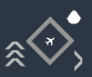, Medium, and Heavy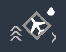.

Each arrival aircraft type carries a different amount of fuel, if fuel runs out and the aircraft is still in the air, the game will end. You can tell their remaining fuel amount by the droplet-shaped fuel gauge located on the top-right of each arrival aircraft. When an aircraft's fuel tank is less than 30%, its fuel gauge will blink.

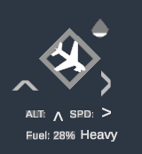

Light aircraft have the following behavior:
- Plane icon size is small.
- Will only have speed of slow , normal . If passing through a waypoint with fast , it will only go up to normal .
- Light aircraft can only land with slow , when instructed to land, will slow down to slow  automatically.
- Landing waypoint will insturct light aircraft to reach slow  and then issue the landing clearance.
- Light aircraft has 50% faster turning speed.
- 2.5% of all random aircraft (arrival & departure) spawn.
- Light aircraft has 3 in-game days worth of fuel.

Heavy aircraft have the following behavior:
- Plane icon size is large.
- 30% of all random aircraft (arrival & departure) spawn.
- Heavy aircraft has 4 in-game days worth of fuel.

Medium aircraft have the following behavior:
- Medium aircraft has 3.5 in-game days worth of fuel.

# Wind

Wind can affect aircraft's takeoff / landing performance. When aircraft are landing in a tailwind, the go-around chance increases significantly. When aircraft takes off in a tailwind, the reject takeoff chance increases significantly. Wind direction is displayed as the arrow direction on the top-left corner of the screen. Yes, it used to be just a back button! 

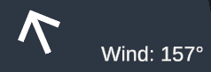

The reject takeoff / go-around probability has the following behavior:
- When aircraft are landing with a full tailwind, the go-around probability is very high.
- When aircraft are taking off with a full tailwind, the reject takeoff probability is very high.
- Reject takeoff / go-around probability drops to 0% when the wind direction is at or below 90 degrees of the runway (full cross-wind).
- The probabilities are not linear between full tail-wind and full cross-wind.
- Lighter aircraft are more susceptible to wind conditions.

# Rare Events

Sometimes, accidents do happen. These rare events show up on average every 6 days:
- Aircraft may arrive with emergency fuel, diverted from a nearby airport, and they need to land immediately.

- Runway excursion happened leading to a runway closure. The runway will be colored red, and all landing aircraft will automatically go around prior to touching down, and aircraft cannot take off from this runway. Note that if the stopped aircraft partially blocked another runway, it effectively closed the other one as well.

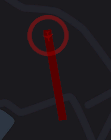

- Weather patterns can also show up in some areas, forcing all aircraft to go to high  to avoid bad weather. If an aircraft enters the weather cell, it would count as a restricted area violation.

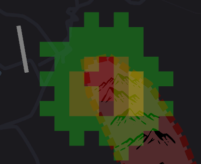

- Aircraft had suffered from an engine failure, you need to bring it back to the field immediately.

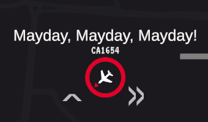

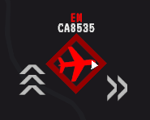

# Other Changes
- You now starts with 3 waiting area upgrades.
- You now get upgrades twice as fast.
- Aircraft flying out-of-bound now count as restricted area violations instead of an instant game-over.

***

# 迷你真实空管

这是一个既迷你又真实的迷你空管Mod。

使用`Tab`可以关闭高度、速度、机型和燃料的具体数值。

 

可通过选项菜单里的`Wind`或在游戏启动项内用 `-disableWind` 关闭风向系统，通过选项菜单里的`Event`或在游戏启动项内用 `-disableEvents` 关闭特情系统。

# 安装

- 右键库中的Mini Airways，[属性 - 测试版 - mod_feat](https://partner.steamgames.com/doc/store/application/branches?l=schinese), 更新。
- 复制 [MiniRealisticAirways.dll](https://github.com/ericpzh/MiniRealisticAirways/blob/main/bin/Debug/netstandard2.1/MiniRealisticAirways.dll) 到 `<path_to_game>\Mini Airways Playtest\BepInEx\plugins`。

# 高度系统

飞机会处于以下三种高度：低、正常和高。飞机的当前高度会在飞机图标的上下显示，并且在信息区显示为：`ALT: ^`。飞机有以下的高度特性：
- 屏幕外进场的飞机会以高进场。
- 进场的飞机只有在低时才能降落。
- 离场飞机将从低起飞。
- 离场飞机只有正常或高到达离场（彩色）航点时触发离场。
- 降落航点将指示飞机首先到达低并发出降落许可。
- 地形（红色区域）不会影响高的飞机。但是，禁飞区（黄色区域）会影响。

- 当两架飞机即将碰撞时, TCAS会命令其中一架爬升，另一架下降。
- 当飞机即将受到地形（红色区域）影响时，GWPS会命令飞机爬升。
- 即将降落的飞机不受TCAS和GWPS影响。

可以通过以下方式控制飞机的高度:
- 在指挥飞机或鼠标悬浮于飞机上时按`W`或滚轮`scroll up`会增加其高度。
- 在指挥飞机或鼠标悬浮于飞机上时按`S`或滚轮`scroll down`会降低其高度。

航点、起飞航点可以控制飞机改变高度：
- 在放置航点时按`W`或滚轮`scroll up`会增加其高度。
- 在放置航点时按`S`或滚轮`scroll down`会降低其高度。

# 速度系统

飞机会处于以下三种速度：慢、正常和快。飞机的当前速度会在飞机图标的左右显示，并且在信息区显示为：`SPD: >`。飞机有以下的速度特性：
- 屏幕外进场的飞机会以正常进场。
- 进场的飞机只有在慢或正常时才能降落。
- 复飞的飞机会以正常起飞。
- 离场飞机将以正常起飞。
- 如果当前速度为快，降落航点将指示飞机达到正常并发出降落许可。

可以通过以下方式控制飞机的速度:
- 指挥飞机或鼠标悬浮于飞机上时按`D`或滚轮`scroll up`并按住`left shift`会增加其速度。
- 指挥飞机或鼠标悬浮于飞机上时按`A`或滚轮`scroll down`并按住`left shift`会降低其速度。

航点、起飞航点可以控制飞机改变速度：
- 在放置航点时按`D`或滚轮`scroll up`并按住`left shift`会增加其速度。
- 在放置航点时按`A`或滚轮`scroll down`并按住`left shift`会降低其速度。
  

# 机型系统

飞机会属于以下三种机型：轻、中、重。

进场飞机会拥有燃油限制，如果燃油耗尽前飞机没有降落的话游戏就会结束。可以通过右上角的水滴图标判断剩余燃料，当剩余燃料不足30%时，此图标会闪烁。

轻型飞机拥有以下特性:
- 最大速度为正常。如果通过具有快的航点，速度也只会变为正常。
- 只有在速度为慢时才能降落，引导到跑道时会自动减速到慢，通过降落航点时也会减速到慢。
- 转弯速度比其他类型快50%。
- 进场时携带游戏内3天的燃料。
- 占所有飞机的2.5%。

重型飞机具有以下特性：
- 进场时携带游戏内4天的燃料。
- 占所有飞机的30%。

中型飞机具有以下特性：
- 进场时携带游戏内3.5天的燃料。

# 风向系统

风向会影响飞机的起降性能。当飞机在顺风中降落时，复飞几率会提高。当飞机在顺风中起飞时，拒绝起飞几率也会提高。你可以在屏幕左上角查看当前风向。

起飞降落具有以下特性:
- 当飞机在顺风中着陆时，复飞概率将变得非常高。
- 当飞机在顺风中起飞时，拒绝起飞概率也变得非常高。
- 当风向与跑道成 90 度（侧风）或以下时，中断起飞/复飞概率接近于零。
- 顺风和侧风之间的复飞概率是非线性的。
- 较轻的飞机更容易受到风向影响。

# 特情
以下特殊事件平均每6天发生一次：
- 一架低油量飞机备降到本场，需要优先安排降落。

- 跑道因各种原因关闭，此时跑道将变成红色，所有即将降落的飞机都会自动复飞，而且飞机也无法从该跑道起飞。要注意的是停在跑道上的飞机如果部分阻塞了另一条跑道，飞机降落到该跑道也会有碰撞判定。

- 恶劣天气会使经过的飞机飞到高，飞机进入恶劣天气和飞入禁飞区拥有同样效果。

- 一架离场飞机遭遇引擎故障，需要立即返场。

# 其他特性
- 开场时自动获得3个等待区升级。
- 升级现在每半天刷新一次。
- 飞出屏幕和飞入禁飞区现在拥有同样效果。